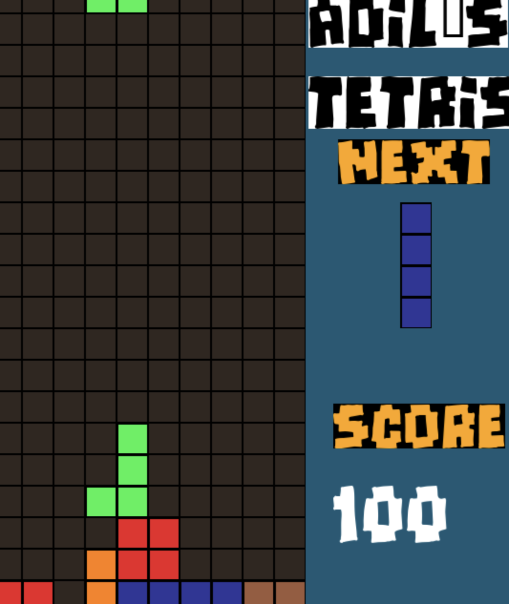

# Tetris Game 🕹️

This is a classic Tetris game implemented in Python using the Pygame library. The game offers a traditional Tetris experience with falling tetrominoes that you can control to complete lines and score points.

## Getting Started 🚀

### Prerequisites

- Python 3.x
- Pygame library

### Installation 🛠️

1. Clone the repository:

    ```bash
    git clone https://github.com/EMMMABK/Tetris.git
    ```

2. Install the required dependencies:

    ```bash
    pip install pygame
    ```

### Running the Game ▶️

Navigate to the project directory and run the following command:

```bash
python main.py
```

## Gameplay 🎮

- **Controls:**
  - Use the `left` and `right` arrow keys to move the falling tetromino sideways.
  - Press the `up` arrow key to rotate the tetromino clockwise.
  - Use the `down` arrow key to speed up the falling of tetrominoes.
  - Press `ESC` to exit the game.

- **Aim:**
  - Fill complete lines horizontally to make them disappear and earn points.
  - Avoid reaching the top of the screen; the game ends if the tetrominoes stack up to the top.

## Screenshot



## Code Structure 🧱

The project contains the following main files:

- `main.py`: Contains the game's main logic and setup.
- `settings.py`: Includes various game settings and configurations.
- `tetris.py`: Manages the Tetris game mechanics and rendering.
- `tetromino.py`: Defines the tetromino blocks and their behavior.

## Customization 🎨

- **Changing Tetromino Shapes:**
  - Modify the `TETROMINOES` dictionary in `settings.py` to create different shapes for tetrominoes.
- **Adjusting Game Settings:**
  - Explore `settings.py` to tweak game-related constants, such as speed, colors, and screen dimensions.

## Acknowledgments 🙌

Special thanks to the Pygame community and the creators of Tetris for the inspiration.

Happy gaming! 🌟
